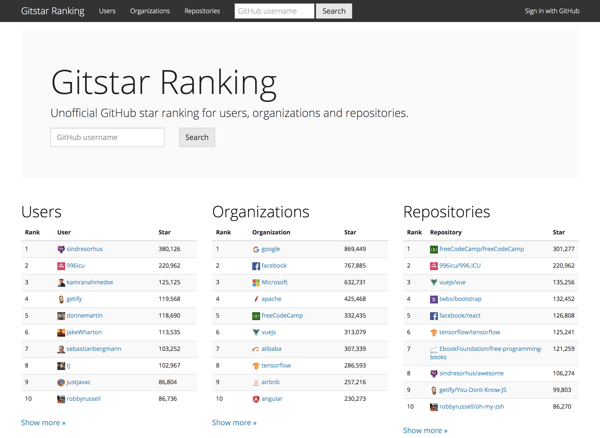

# Gitstar Ranking

GitHub star ranking for users, organizations and repositories.

https://gitstar-ranking.com

## Build Status

| Server | Worker |
|:-------|:-------|
| [](https://travis-ci.org/k0kubun/gitstar-ranking) | [](https://app.wercker.com/project/byKey/4f1170bbabcfa8b28e379746dff4e167) |

## Docker Hub

Docker container images are built on Docker Hub with Automated Build.

* Server: https://hub.docker.com/r/k0kubun/gitstar-ranking-server/builds
* Worker: https://hub.docker.com/r/k0kubun/gitstar-ranking-worker/builds

## Screen Shot

[](http://githubranking.com)

## Development

### Prerequisites

Install following dependencies.

- Ruby 2.4.1
- Java 1.8.0
- MySQL 5.7
- Node.js 6.0.0+
- Yarn

Then, execute following command.

```
bin/setup
```

#### Ubuntu

```bash
curl -sL deb.nodesource.com/setup_6.x | sudo bash -
sudo apt install nodejs

# https://yarnpkg.com/lang/en/docs/install/
curl -sS https://dl.yarnpkg.com/debian/pubkey.gpg | sudo apt-key add -
echo "deb https://dl.yarnpkg.com/debian/ stable main" | sudo tee /etc/apt/sources.list.d/yarn.list
sudo apt-get update && sudo apt-get install yarn

# make config/database.yml functional
sudo vi /lib/systemd/system/mysql.service # add --skip-grant-tables to ExecStart
sudo systemctl daemon-reload
sudo systemctl restart mysql
mysql -uroot
mysql> use mysql;
mysql> update user set authentication_string=PASSWORD('') where User='root';
mysql> update user set plugin='mysql_native_password' where User='root';
mysql> flush privileges;
sudo vi /lib/systemd/system/mysql.service # remove --skip-grant-tables from ExecStart
sudo systemctl daemon-reload
sudo systemctl restart mysql
```

### Run servers

```sh
foreman start
```

## Requirements

- MySQL's time\_zone must be UTC.
